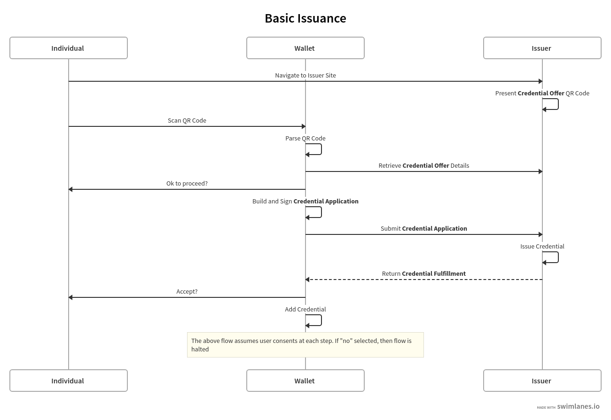
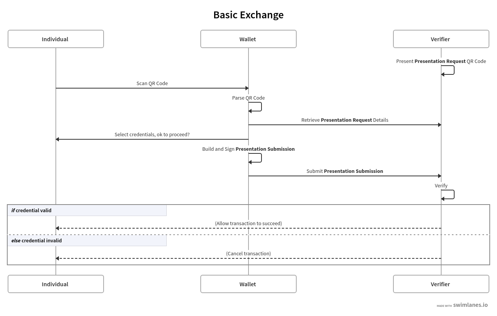

# Verite Services and APIs

The Verite product motivation and protocol can be seen at [https://verite.id/](https://verite.id/). 

Our services are built based on the protocol defined by [https://verite.id/](https://verite.id/). Our services are not interacted with any service there.

_Issuer_ and _verifier_ are the two services that we provide. They're our implementation of the _insurance_ and _verification_ processes.


<br/><br/>
# Issuer

_Issuer_ offers credentials to wallets after wallets submit necessary information.  

## Wallet flow
This flow shows how wallets and the _issuer_ service interact.



1. A User navigates to the Issuer site
2. The Issuer presents a QR code.
3. User scans the QR code with their wallet.
4. Wallet parses the QR code, which encodes a JSON object with a challengeTokenUrl property.
5. Wallet performs a GET request at that URL to return a Credential Offer, a wrapper around a Credential  Manifest, with three supplementary properties:
> * The issuer DID.
> * A URL for the wallet to submit a Credential Application.
> * A challenge to sign.
6. The wallet prompts the user to proceed. The Credential Manifest includes descriptive properties, e.g. in the Verite demo app a title and description of the credential are shown.
7. Once the recipient proceeds, the wallet prepares a signed Credential Application,
> * If the wallet doesn't have a DID, it generates one.
> * The wallet creates a Credential Application for the DID.
> * The application is signed along with the challenge in the Credential Offer
> * The Verite library exposes a convenience method createCredentialApplication for this purpose.
8. Wallet submits the Credential Application to the URL found in the Credential Offer.
The Issuer creates a Verifiable Credential and returns it to the wallet as a Credential Fulfillment.
Wallet persists the credential.


## Host 

https://issuer-sandbox.circle.com 


## API Endpoints


### GET `/v1/issuance/qrcode`


**Description:** This endpoint returns a binary-format QR code. This does not have to be implemented by the dapp. Alternatively, it can begin by scanning the QR code below.


### GET `/v1/issuance/manifest/kyc`


**Description:** This endpoint returns a[ CredentialOffer](https://verite.id/docs/appendix/messages#credential-offer). 

Response example


```json
{
  "body": {
    "challenge": "a2b8266a-b108-48c8-b461-b4a10b369d15",
    "manifest": {
      "id": "KYCAMLAttestation",
      "version": "0.1.0",
      "issuer": {
        "id": "did:key:zQ3shaWBKgKfo2yk2nncahcpXjdrKVxE2VB3CzEu2MhJwWcZX",
        "name": "Circle",
        "styles": {}
      },
      "output_descriptors": [
        {
          "description": "Attestation that Circle has completed KYC/AML verification for this subject",
          "display": {
            "description": {
              "text": "The KYC authority processes Know Your Customer and Anti-Money Laundering analysis, potentially employing a number of internal and external vendor providers."
            },
            "properties": [
              {
                "label": "Authority",
                "path": [
                  "$.KYCAMLAttestation.authorityName"
                ],
                "schema": {
                  "type": "string"
                }
              },
              {
                "label": "Authority URL",
                "path": [
                  "$.KYCAMLAttestation.authorityUrl"
                ],
                "schema": {
                  "format": "uri",
                  "type": "string"
                }
              },
              {
                "label": "Approved At",
                "path": [
                  "$.KYCAMLAttestation.approvalDate"
                ],
                "schema": {
                  "format": "date-time",
                  "type": "string"
                }
              }
            ],
            "subtitle": {
              "fallback": "Includes date of approval",
              "path": [
                "$.approvalDate",
                "$.vc.approvalDate"
              ]
            },
            "title": {
              "fallback": "Verity KYC Attestation",
              "path": [
                "$.KYCAMLAttestation.authorityName"
              ]
            }
          },
          "id": "kycAttestationOutput",
          "name": "Proof of KYC from Circle",
          "schema": [
            {
              "uri": "https://verity.id/schemas/identity/1.0.0/KYCAMLAttestation"
            }
          ],
          "styles": {
            "background": {
              "color": "#EC4899"
            },
            "hero": {
              "uri": "http://127.0.0.1:3000/img/kyc-aml-hero.png",
              "alt": "KYC+AML Visual"
            },
            "text": {
              "color": "#FFFFFF"
            },
            "thumbnail": {
              "uri": "http://127.0.0.1:3000/img/kyc-aml-thumbnail.png",
              "alt": "Circle Logo"
            }
          }
        }
      ],
      "format": {
        "jwt_vc": {
          "alg": [
            "ES256K"
          ]
        },
        "jwt_vp": {
          "alg": [
            "ES256K"
          ]
        }
      },
      "presentation_definition": {
        "format": {
          "jwt_vp": {
            "alg": [
              "ES256K"
            ]
          }
        },
        "id": "ProofOfControlPresentationDefinition",
        "input_descriptors": [
          {
            "id": "proofOfIdentifierControlVP",
            "name": "Proof of Control Verifiable Presentation",
            "purpose": "A Verifiable Presentation establishing proof of identifier control over the DID.",
            "schema": [
              {
                "uri": "https://verity.id/schemas/identity/1.0.0/ProofOfControl"
              }
            ]
          }
        ]
      }
    }
  },
  "created_time": "2022-02-28T00:17:06.438Z",
  "expires_time": "2022-03-01T00:17:06.438Z",
  "from": "did:web:circle.com",
  "id": "43cb109b-ff97-400e-b9ab-936c5664a05d",
  "reply_url": "https://localhost:10050/api/v1/issuance/credential/43cb109b-ff97-400e-b9ab-936c5664a05d",
  "type": "https://verity.id/types/CredentialOffer"
}
```


<br></br>
### POST `/v1/issuance`


**Description:** dApp submit CredentialApplication to this endpoint and get a CredentialFulfillment. 

CredentialApplication example (JWT)

`{eyJ0eXAiOiJKV1QiLCJhbGciOiJIUzI1NiJ9.eyJzdWIiOiJkaWQ6a2V5OnpRM3NodjM3OFB2a011UnJZTUdGVjlhM010S3BKa3RlcWIyZFViUU1FTXZ0V2MydEUiLCJpc3MiOiJkaWQ6a2V5OnpRM3NodjM3OFB2a011UnJZTUdGVjlhM010S3BKa3RlcWIyZFViUU1FTXZ0V2MydEUiLCJjcmVkZW50aWFsX2FwcGxpY2F0aW9uIjp7ImlkIjoiNmVkNmY2OTgtM2FmMC00MjA0LWFmZDMtM2E1NTY1YzJjMzA4IiwibWFuaWZlc3RfaWQiOiJLWUNBTUxBdHRlc3RhdGlvbiIsImZvcm1hdCI6eyJqd3RfdnAiOnsiYWxnIjpbIkVTMjU2SyJdfX19LCJwcmVzZW50YXRpb25fc3VibWlzc2lvbiI6eyJpZCI6ImI0ZjQzMzEwLTFkNmItNDI1ZC04NGM2LWY4YWZhYzNmZTI0NCIsImRlZmluaXRpb25faWQiOiJQcm9vZk9mQ29udHJvbFByZXNlbnRhdGlvbkRlZmluaXRpb24iLCJkZXNjcmlwdG9yX21hcCI6W3siaWQiOiJwcm9vZk9mSWRlbnRpZmllckNvbnRyb2xWUCIsImZvcm1hdCI6Imp3dF92cCIsInBhdGgiOiIkLnByZXNlbnRhdGlvbiJ9XX0sInZwIjp7IkBjb250ZXh0IjpbImh0dHBzOi8vd3d3LnczLm9yZy8yMDE4L2NyZWRlbnRpYWxzL3YxIl0sInR5cGUiOlsiVmVyaWZpYWJsZVByZXNlbnRhdGlvbiIsIkNyZWRlbnRpYWxGdWxmaWxsbWVudCJdLCJob2xkZXIiOiJkaWQ6d2ViOmNpcmNsZS5jb20iLCJ2ZXJpZmlhYmxlQ3JlZGVudGlhbCI6WyJleUpoYkdjaU9pSkZaRVJUUVNJc0luUjVjQ0k2SWtwWFZDSjkuLi4uN3d3aS1ZUlgiXX19.HaZI1KivjseuAzItUvDl-TBVHSQ1F_m542-_8sesuLY}`

Decode it, it is a json blob.


```json
{
  "sub": "did:key:zQ3shv378PvkMuRrYMGFV9a3MtKpJkteqb2dUbQMEMvtWc2tE",
  "iss": "did:key:zQ3shv378PvkMuRrYMGFV9a3MtKpJkteqb2dUbQMEMvtWc2tE",
  "credential_application": {
    "id": "2ce196be-fcda-4054-9eeb-8e4c5ef771e5",
    "manifest_id": "KYCAMLAttestation",
    "format": {
      "jwt_vp": {
        "alg": ["ES256K"]
      }
    }
  },
  "presentation_submission": {
    "id": "b4f43310-1d6b-425d-84c6-f8afac3fe244",
    "definition_id": "ProofOfControlPresentationDefinition",
    "descriptor_map": [
      {
        "id": "proofOfIdentifierControlVP",
        "format": "jwt_vp",
        "path": "$.presentation"
      }
    ]
  },
  "vp": {
    "@context": [
      "https://www.w3.org/2018/credentials/v1"
    ],
    "type": [
      "VerifiablePresentation",
      "CredentialFulfillment"
    ],
    "holder": "did:web:circle.com",
    "verifiableCredential": [
      "eyJhbGciOiJFZERTQSIsInR5cCI6IkpXVCJ9....7wwi-YRX"
    ]
  }
}
```


CredentialFulfillment example. JWT

`{eyJ0eXAiOiJKV1QiLCJhbGciOiJFUzI1NksifQ.eyJzdWIiOiJkaWQ6a2V5OnpRM3NoYVdCS2dLZm8yeWsybm5jYWhjcFhqZHJLVnhFMlZCM0N6RXUyTWhKd1djWlgiLCJjcmVkZW50aWFsX2Z1bGZpbGxtZW50Ijp7ImRlc2NyaXB0b3JfbWFwIjpbeyJmb3JtYXQiOiJqd3RfdmMiLCJpZCI6InByb29mT2ZJZGVudGlmaWVyQ29udHJvbFZQIiwicGF0aCI6IiQucHJlc2VudGF0aW9uLmNyZWRlbnRpYWxbMF0ifV0sImlkIjoiNmVkNmY2OTgtM2FmMC00MjA0LWFmZDMtM2E1NTY1YzJjMzA4IiwibWFuaWZlc3RfaWQiOiJLWUNBTUxBdHRlc3RhdGlvbiJ9LCJpc3MiOiJkaWQ6a2V5OnpRM3NoYVdCS2dLZm8yeWsybm5jYWhjcFhqZHJLVnhFMlZCM0N6RXUyTWhKd1djWlgiLCJ2cCI6eyJAY29udGV4dCI6WyJodHRwczovL3d3dy53My5vcmcvMjAxOC9jcmVkZW50aWFscy92MSJdLCJ0eXBlIjpbIlZlcmlmaWFibGVQcmVzZW50YXRpb24iLCJDcmVkZW50aWFsRnVsZmlsbG1lbnQiXSwiaG9sZGVyIjoiZGlkOmtleTp6UTNzaGFXQktnS2ZvMnlrMm5uY2FoY3BYamRyS1Z4RTJWQjNDekV1Mk1oSndXY1pYIiwidmVyaWZpYWJsZUNyZWRlbnRpYWwiOlsiZXlKMGVYQWlPaUpLVjFRaUxDSmhiR2NpT2lKRlV6STFOa3NpZlEuZXlKemRXSWlPaUprYVdRNmEyVjVPbnBSTTNOb2RqTTNPRkIyYTAxMVVuSlpUVWRHVmpsaE0wMTBTM0JLYTNSbGNXSXlaRlZpVVUxRlRYWjBWMk15ZEVVaUxDSnVZbVlpT2pFMk5EWXdNRGMwTXpBc0ltbHpjeUk2SW1ScFpEcHJaWGs2ZWxFemMyaGhWMEpMWjB0bWJ6SjVhekp1Ym1OaGFHTndXR3BrY2t0V2VFVXlWa0l6UTNwRmRUSk5hRXAzVjJOYVdDSXNJbVY0Y0NJNk1UWTBOall4TWpJek1Dd2lkbU1pT25zaVFHTnZiblJsZUhRaU9sc2lhSFIwY0hNNkx5OTNkM2N1ZHpNdWIzSm5Mekl3TVRndlkzSmxaR1Z1ZEdsaGJITXZkakVpTENKb2RIUndjem92TDNabGNtbDBlUzVwWkM5cFpHVnVkR2wwZVNKZExDSjBlWEJsSWpwYklsWmxjbWxtYVdGaWJHVkRjbVZrWlc1MGFXRnNJaXdpUzFsRFFVMU1RWFIwWlhOMFlYUnBiMjRpWFN3aVkzSmxaR1Z1ZEdsaGJGTjFZbXBsWTNRaU9uc2lTMWxEUVUxTVFYUjBaWE4wWVhScGIyNGlPbnNpWVhCd2NtOTJZV3hFWVhSbElqb2lNakF5TWkwd01pMHlPRlF3TURveE56b3hNQzQwTmpCYUlpd2ljSEp2WTJWemN5STZJbWgwZEhCek9pOHZkbVZ5YVhSbExtbGtMM05qYUdWdFlYTXZaR1ZtYVc1cGRHbHZibk12TVM0d0xqQXZhM2xqWVcxc0wzVnpZU0lzSW5SNWNHVWlPaUpMV1VOQlRVeEJkSFJsYzNSaGRHbHZiaUo5TENKcFpDSTZJbVJwWkRwclpYazZlbEV6YzJoaFYwSkxaMHRtYnpKNWF6SnVibU5oYUdOd1dHcGtja3RXZUVVeVZrSXpRM3BGZFRKTmFFcDNWMk5hV0NKOUxDSnBjM04xWVc1alpVUmhkR1VpT2lJeU1ESXlMVEF5TFRJNFZEQXdPakUzT2pFd0xqUTJNRm9pZlgwLlJPTzY5T3R2T0dERTJGeUV0Wk9rMVhGajZWTnQwUGpTbndXMm01X3I0RlNGbTgwTkhQZkRQdDZUZTE5SDNqcVVpM2NwYXZIWG5LZlROLVdORHQwdXJnIl19fQ.WRlC9nGx4uxaQ4ab_pV1F0_vJT_GzAWP5-wIYhL3v3eU95ncUkOlQ5d4qvhEyYuT5X0EQ71ZshWr6wVcEPE7_w}`

Decode it


```json
{
  "sub": "did:key:zQ3shaWBKgKfo2yk2nncahcpXjdrKVxE2VB3CzEu2MhJwWcZX",
  "credential_fulfillment": {
    "descriptor_map": [
      {
        "format": "jwt_vc",
        "id": "proofOfIdentifierControlVP",
        "path": "$.presentation.credential[0]"
      }
    ],
    "id": "6ed6f698-3af0-4204-afd3-3a5565c2c308",
    "manifest_id": "KYCAMLAttestation"
  },
  "iss": "did:key:zQ3shaWBKgKfo2yk2nncahcpXjdrKVxE2VB3CzEu2MhJwWcZX",
  "vp": {
    "@context": [
      "https://www.w3.org/2018/credentials/v1"
    ],
    "type": [
      "VerifiablePresentation",
      "CredentialFulfillment"
    ],
    "holder": "did:key:zQ3shaWBKgKfo2yk2nncahcpXjdrKVxE2VB3CzEu2MhJwWcZX",
    "verifiableCredential": [
      "eyJ0eXAiOiJKV1QiLCJhbGciOiJFUzI1NksifQ.eyJzdWIiOiJkaWQ6a2V5OnpRM3NodjM3OFB2a011UnJZTUdGVjlhM010S3BKa3RlcWIyZFViUU1FTXZ0V2MydEUiLCJuYmYiOjE2NDYwMDc0MzAsImlzcyI6ImRpZDprZXk6elEzc2hhV0JLZ0tmbzJ5azJubmNhaGNwWGpkcktWeEUyVkIzQ3pFdTJNaEp3V2NaWCIsImV4cCI6MTY0NjYxMjIzMCwidmMiOnsiQGNvbnRleHQiOlsiaHR0cHM6Ly93d3cudzMub3JnLzIwMTgvY3JlZGVudGlhbHMvdjEiLCJodHRwczovL3Zlcml0eS5pZC9pZGVudGl0eSJdLCJ0eXBlIjpbIlZlcmlmaWFibGVDcmVkZW50aWFsIiwiS1lDQU1MQXR0ZXN0YXRpb24iXSwiY3JlZGVudGlhbFN1YmplY3QiOnsiS1lDQU1MQXR0ZXN0YXRpb24iOnsiYXBwcm92YWxEYXRlIjoiMjAyMi0wMi0yOFQwMDoxNzoxMC40NjBaIiwicHJvY2VzcyI6Imh0dHBzOi8vdmVyaXRlLmlkL3NjaGVtYXMvZGVmaW5pdGlvbnMvMS4wLjAva3ljYW1sL3VzYSIsInR5cGUiOiJLWUNBTUxBdHRlc3RhdGlvbiJ9LCJpZCI6ImRpZDprZXk6elEzc2hhV0JLZ0tmbzJ5azJubmNhaGNwWGpkcktWeEUyVkIzQ3pFdTJNaEp3V2NaWCJ9LCJpc3N1YW5jZURhdGUiOiIyMDIyLTAyLTI4VDAwOjE3OjEwLjQ2MFoifX0.ROO69OtvOGDE2FyEtZOk1XFj6VNt0PjSnwW2m5_r4FSFm80NHPfDPt6Te19H3jqUi3cpavHXnKfTN-WNDt0urg"
    ]
  }
}
```

<br></br>

# Verifier


## Wallet flow
This flow shows how wallets and the _verifier_ service interact.




1. Verifier prompts user for the Ethereum address the Verification Record will be bound to
2. User provides their Ethereum address (e.g. copy pasting, or by connecting a wallet)
3. Verifier generates a JWT that encodes the user's address, that will later be used to generate the URL the mobile wallet will submit to.
4. Verifier shows QR Code
5. User scans QR Code with their wallet.
6. Wallet parses the QR code, which encodes a JSON object with a challengeTokenUrl property.
7. Wallet performs a GET request at that URL to return a Verification Offer, a wrapper around a Presentation Request, with three supplementary properties:
> * The verifier DID.
> * A URL for the wallet to submit the Presentation Submission, using the unique JWT generated earlier.
8. The wallet prompts the user to select credential(s) from the set of matches.
9. Wallet prepares a Presentation Submission including
> * Wallet DID is the holder, proving control over the DID. In the Verite examples, the holder must match the credential subjects, validating the holder and subject are the same.
> * Any Verifiable Credential(s) necessary to complete verification.
> * Wallet is the Presentation Request holder and signs it along with the challenge
10. Wallet submits the Presentation Submission to the URL found in the Verification Offer.
11. The Verifier validates all the inputs
12. Verifiers generates a Verification Record and adds it to the registry

## Host

https://verifier-sandbox.circle.com 


## API Endpoints


### POST `/verifications`


**Description:** This endpoint is called by the Dapp to initialize a new Verification process.  The Dapp will POST any configuration / requirements that will affect the verification process and result (e.g. ”solana” versus “ethereum”).  The endpoint will respond with a url which resolves to the “Verification Offer”.  The response body can be presented as a QR Code or automatically trigger a browser extension to continue the verification process.  


Request Body:


```json
{
   "network": "ethereum" | "solana",
   "subjectAddress": "0x...",
   "chainId": 1
}
```


Response Body:


```json
{
   "challengeTokenUrl": "https://host/verifications/7ad5fb55-85d6-435d-afa7-d8a00ed5f89d"
}
```


### GET `/verifications/<id>`


**Description: **This endpoint is called by the Credential Holder (it is the “`challengeTokenUrl`” from POST /verifications). This endpoint returns a fully formed Verification Offer (Presentation Request), which describes what information is required to pass this verification.  The Credential Holder will use this information and submit their Credentials to the “**<code>reply_url</code></strong>” defined in the body.  

See: [https://verity.id/docs/patterns/verification-flow#presentation-requests-and-definitions](https://verity.id/docs/patterns/verification-flow#presentation-requests-and-definitions)


Response Body:


```json
{
  "id": "7ad5fb55-85d6-435d-afa7-d8a00ed5f89d",
  "type": "https://circle.com/types/VerificationRequest",
  "from": "did:web:circle.com",
  "created_time": "2021-12-21T16:20:30.169Z",
  "expires_time": "2022-01-20T16:20:30.169Z",
  "reply_url": "https://host/verifications/7ad5fb55-85d6-435d-afa7-d8a00ed5f89d",
  "body": {
    "status_url": "https://host/verifications/7ad5fb55-85d6-435d-afa7-d8a00ed5f89d/status",
    "challenge": "84655e95-7299-454c-9751-1b19176285ec",
    "presentation_definition": {
      "id": "7ad5fb55-85d6-435d-afa7-d8a00ed5f89d",
      "input_descriptors": [
        {
          "id": "kycaml_input",
          "name": "Proof of KYC",
          "purpose": "Please provide a valid credential from a KYC/AML issuer",
          "schema": [
            {
              "uri": "https://circle.com/schemas/identity/1.0.0/KYCAMLAttestation",
              "required": true
            }
          ],
          "constraints": {
            "statuses": {
              "active": {
                "directive": "required"
              },
              "revoked": {
                "directive": "disallowed"
              }
            },
            "is_holder": [
              {
                "field_id": [
                  "subjectId"
                ],
                "directive": "required"
              }
            ],
            "fields": [
              {
                "path": [
                  "$.issuer.id",
                  "$.issuer",
                  "$.vc.issuer",
                  "$.iss"
                ],
                "purpose": "The issuer of the credential must be trusted",
                "filter": {
                  "pattern": "^did:web:circle.com$",
                  "type": "string"
                }
              },
              {
                "path": [
                  "$.credentialSubject.KYCAMLAttestation.process",
                  "$.vc.credentialSubject.KYCAMLAttestation.process",
                  "$.KYCAMLAttestation.process"
                ],
                "purpose": "The process used for KYC/AML.",
                "predicate": "required",
                "filter": {
                  "type": "string"
                }
              },
              {
                "path": [
                  "$.credentialSubject.KYCAMLAttestation.approvalDate",
                  "$.vc.credentialSubject.KYCAMLAttestation.approvalDate",
                  "$.KYCAMLAttestation.approvalDate"
                ],
                "purpose": "The date upon which this KYC/AML Attestation was issued.",
                "predicate": "required",
                "filter": {
                  "type": "string"
                }
              }
            ]
          }
        }
      ]
    }
  }
}
```


### POST `/verifications/<id>`


**Description: **This is the Credential Submission endpoint.  A Credential Holder’s wallet will build a Verifiable Presentation to submit their Credentials to this endpoint (defined as the “reply_url” from the Verification Offer).  Upon submission, the endpoint will process and verify the credentials.  It will synchronously return the verification status and verification result.

See: [https://verity.id/docs/patterns/verification-flow#credential-submission](https://verity.id/docs/patterns/verification-flow#credential-submission) 


Request Body (decoded):


```json
{
  "@context": ["https://www.w3.org/2018/credentials/v1"],
  "presentation_submission": {
    "id": "d885c76f-a908-401a-9e41-abbbeddfe886",
    "definition_id": "KYCAMLPresentationDefinition",
    "descriptor_map": [
      {
        "id": "kycaml_input",
        "format": "jwt_vc",
        "path": "$.presentation.verifiableCredential[0]"
      }
    ]
  },
  "verifiableCredential": [
    {
      "type": ["VerifiableCredential", "KYCAMLAttestation"],
      "credentialSubject": {
        "id": "did:key:z6Mkjo9pGYpv88SCYZW3ZT1dxrKYJrPf6u6hBeGexChJF4EN",
        "KYCAMLAttestation": {
          "@type": "KYCAMLAttestation",
          "process": "https://circle.com/schemas/definitions/1.0.0/kycaml/usa",
          "approvalDate": "2021-09-14T02:00:07.540Z",
        }
      },
      "credentialStatus": {
        "id": "http://circle.com/revocation#1",
        "type": "RevocationList2021Status",
        "statusListIndex": 1,
        "statusListCredential": "http://circle.com/revocation"
      },
      "issuer": {
        "id": "did:web:circle.com"
      }
    }
  ]
}
```


Response Body:


```json
{
   "status": "success",
   "result": { "verificationResult": ..., "signature": ... }
}
```


```json
{
  "status": "failure",
  "message": "Invalid Verifiable Credential"
}
```


### GET `/verifications/<id>/status`


**Description:** This endpoint provides the status of the asynchronous verification (as defined as ``status_url`` in the Verification Offer).  The dApp will use this to check this endpoint periodically to determine if the Verification was successful or not.  If the verification was successful, a verification result and signature will be provided as part of the payload.  This response body is the same as the **<code>POST /verifications/&lt;id></code></strong> response body.


Response Body:


```json
{
   "status": "pending",
}
```


```json
{
   "status": "success",
   "result": { "verificationResult": ..., "signature": ... }
}
```


```json
{
  "status": "failure",
  "message": "Invalid Verifiable Credential"
}
```
